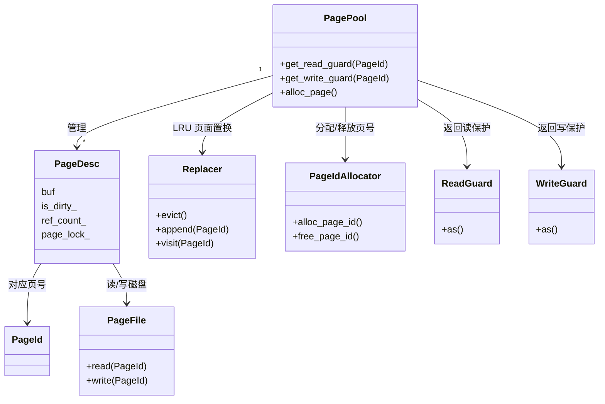
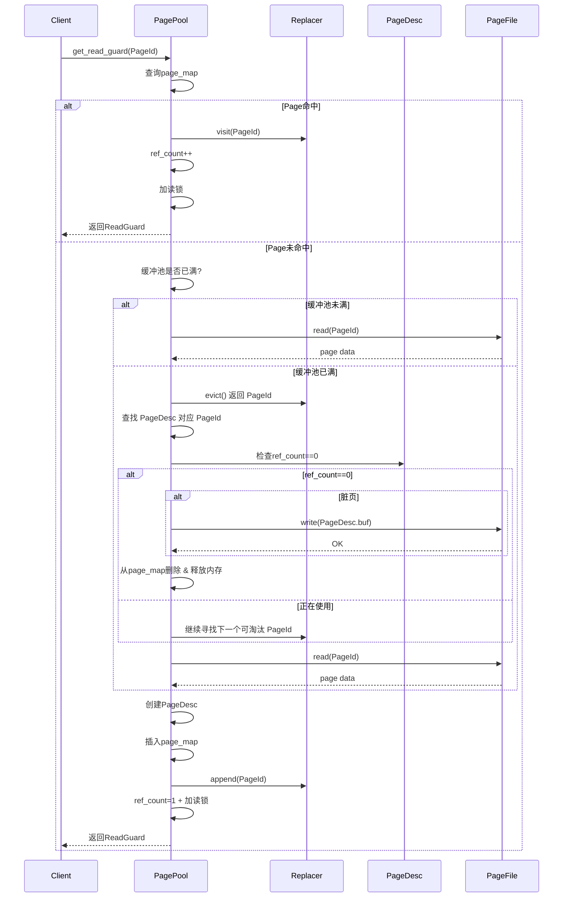

# 概述
数据库里的“页”（Page）就是磁盘上的最小数据单位。缓冲池（PagePool）就是在内存里保存这些页的地方，减少每次访问都去磁盘。
核心功能：
- 获取页：从内存拿或者从磁盘读。
- 修改页：通过写锁保证线程安全。
- 释放页：当内存满了，用 LRU 策略淘汰不常用的页。
- 管理页号：分配和回收 PageId，保证每页都有唯一编号。
# 类设计
```cpp
struct PageId {
    uint32_t allocator_id_;
    uint32_t page_no_;
};
struct PageHead {
    uint16_t begin_pos_;
    uint16_t end_pos_;
    uint16_t free_size_;
};
struct AllocatorPageHead：public PageHead {
    PageId next_page_id_;
    uint32_t slotNum;
}
struct MetaAllocatorPageHead:public AllocatorPageHead {
    PageId free_page_list_;
    PageId tail_page_id_; // allocator page链表的尾节点
    uint32_t hwm_page_no_;
}
// 管理page_id的分配和释放
class PageIdAllocator {
private:
    uint32_t allocator_id_;
public:
    pair<Status, PageId> alloc_page_id();
    Status free_page_id(PageId id);
};
// 写入/读入PageId的页缓存
class PageFile {
private:
    uint32_t block_size_;
    vector<int, LocalAllocator<int>>fd;
public:
    Status write(PageId id, uint8_t *data);
    Status read(PageId id, uint8_t *data);
};

struct PageDesc {
    PageId id_;
    uint8_t *buf;
    atomic<bool> is_dirty_;
    atomic<uint32_t> ref_count_;
    RwSpinLock page_lock_; // 访问buf的锁
};
class PageGuard {
protected:
    shared_ptr<PageDesc> page_desc_;
public:
    auto get_page_id() -> PageId;
};
class ReadGuard:public PageGuard {
public:
    ReadGuard(shared_ptr<PageDesc> page_desc); // 加page读锁，引用计数加1
    ~ReadGuard(); // 解锁，引用计数减1
    template <class T> 
    const T *as()
    {
        return static_cast<T *>(page_desc_->buf);
    }
};

class WriteGuard {
public:
    WriteGuard(shared_ptr<PageDesc> page_desc); // 加page写锁，引用计数加1
    ~WriteGuard(); // 解锁，引用计数减1
    template <class T> 
    T *as()
    {
        return static_cast<T *>(page_desc_->buf);
    }
};
// 管理换入换出链表
class Replacer {
private:
    List<PageId> page_id_list_;
public:
    PageId evict();
    void append(PageId id);
    void visit(PageId id);
}
// 管理pageId到页缓存的映射
class PagePool {
private:
    SpinLock lock; // 访问page_map_ 和 replacer, pagedesc 需要加锁
    unordered_map<PageId, uint8_t *, LocalAllocator, PageIdCompare> page_map_;
    MemoryContext *mem_ctx_;
    shared_ptr<PageFile> page_file_;
    unique_ptr<Replacer> replacer_;
public:
    static PagePool instance(); // 单例模式
    pair<Status, ReadGuard&&> get_read_guard(const PageId &id);
    pair<Status, WriteGuard&&> get_write_guard(const PageId &id);
    auto alloc_page(uint32_t allocator_id) -> pair<Status, WriteGuard&&>;
    auto free_page(const PageId& id) -> Status;
};

```
# 三、原理
## 3.1 架构
- 总体结构

- 目录结构
src
 |
 |_____ storage/
            |
            |_____ include/
                     |
                     |_____ page_pool.h # 定义PagePool类、PageHead、PageGuard、ReadGuard、WriteGuard、PageId
            |
            |_____ page_pool/
                      |
                      |_____ page_desc.h # 定义PageDesc
                      |
                      |_____ page_pool.cc # 实现 PagePool、定义PageDesc类
                      |
                      |_____ page_guard.cc # 实现PageGuard、ReadGuard、WriteGuard
                      |
                      |_____ page_guard.cc # 实现PageGuard、ReadGuard、WriteGuard
                      |
                      |_____ page_file.h # 定义 PageFile类
                      |
                      |_____ page_file.cc # 实现PageFile类
                      |
                      |_____ page_id_allocator.h # 定义PageIdAllocator类、Allocator PageHead、MetaAllocatorPageHead
                      |
                      |_____ page_id_allocator.cc # 实现Allocator类
                      |
                      |_____ replacer.h # 定义replacer类
                      |
                      |_____ replacer.cc # 实现replacer


## 3.2 页id的分配与释放
每个allocator的第一个page_no(即PageId(allocator_id, 0))用于页id的分配管理。
其页结构为
```
MetaAllocatorPageHead | slot | slot |...
```
### 3.2.1 页号释放
- 单页释放
存储单页释放的页的结构为：
```
AllocatorPageHead|slot|slot|...
```
slot存放的是已经释放的pageId. 这类页被称为Allocator Page.
当Allocator Page满了，已经无法存放新的slot时，下一个被释放的页会被链接到Allocator Page链表末尾，作为一个空的Allocator Page, 继续用于存放释放的PageId
- 页链表释放
heap中可能已经存在链表的页，当他们一起释放时，我们可以直接将页链表挂到MetaAllocatorPageHead的
free_page_list_上
### 3.2.2 页号分配
- free_page_list_上有空闲页，从链表的头节点上摘取进行分配
- free_page_list_上没有空闲页, 从tail_page_id_的allocator page上分配最后一个slot的page_id, 如果没有slot, 就将最后一个allocator page分配出去
- allocator page上也没有, 将hwm_page_no_分配出去。
## 3.3 换入换出
采用LRU换入换出
## 3.4 PageGuard 获取流程
- 客户端请求某页。
- PagePool 检查内存：
    存在 → 返回 PageDesc + 加锁 + 引用计数 + Read/WriteGuard。
    不存在 → 从磁盘读入，创建 PageDesc，再返回 Guard。
- RAII Guard 会在作用域结束时自动释放锁、减引用计数。
- LRU 链表会记录访问顺序，内存满时淘汰最久未使用的页。

# 用例设计
# 遗留任务
- LRU-K
- 并发