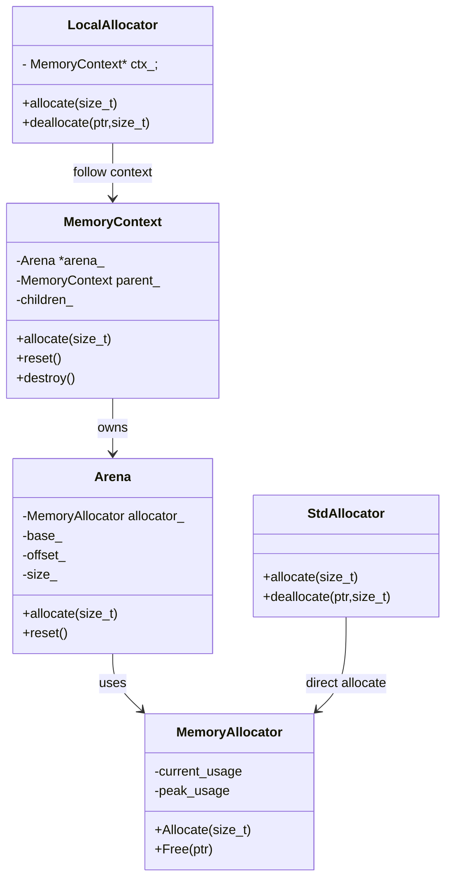
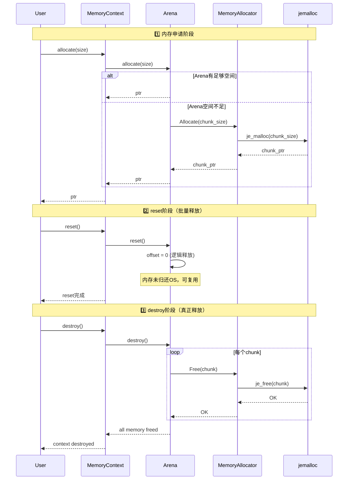
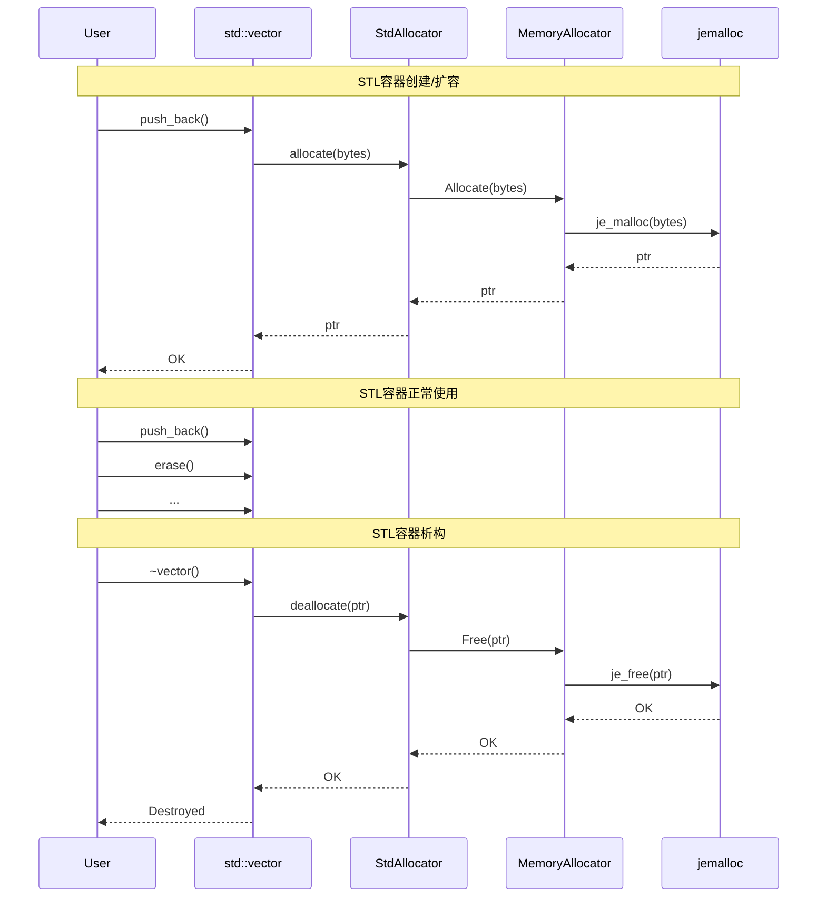
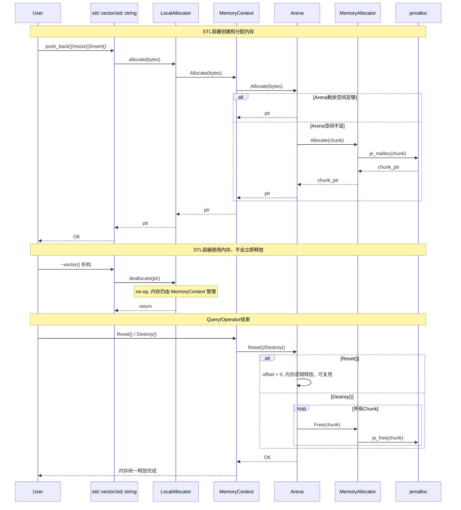

# 一、概述
# 1.1 背景
数据库内核在运行过程中需要频繁进行动态内存分配，包括：
- SQL执行过程中的表达式对象
- Tuple对象
- Hash Join哈希表
- 排序缓存
- MemTable
- SkipList节点
- Buffer元数据
- Catalog缓存

如果直接使用系统malloc/free, 会产生如下问题：
- 多线程锁竞争
- 内存碎片增加
- Cache Locality较差
- 无法统计模块内存占用
- 生命周期管理困难
- STL容器难以统一纳入数据库内存管理体系
因此需要设计统一的动态内存管理模块，对底层分配器进行封装，并提供Arena和STL Allocator支持。
# 1.2 目标
设计一个轻量级、高性能、可扩展的动态内存管理模块。支持：
- 基于jemalloc实现底层内存分配
- 支持MemoryContext/Arena机制
- 支持STL Allocator接口
- 支持内存统计
- 支持批量释放
- 支持线程安全
- 支持后续替换底层分配器
- 支持统计：当前占用内存、历史峰值内存
# 二、类设计
```cpp
// 负责封装jemalloc

class MemoryAllocator {
public:
    static MemoryAllocator& Instance(); // 单例模式，负责临时对象的分配与释放
    void* Allocate(size_t size);
    void* AllocateAligned(size_t size, size_t alignment);
    void Deallocate(void* ptr);
    size_t UsableSize(void* ptr);
    size_t AllocatedBytes() const;
    size_t PeakAllocatedBytes() const; 
private:
    std::atomic<size_t> allocated_bytes_; // 当前内存大小
    std::atomic<size_t> peak_allocated_bytes_; // 记录峰值内存
};
// 负责连续分配。
class Arena {
public:
    explicit Arena(size_t block_size = 4 * 1024 * 1024);
    void* Allocate(size_t size);
    void Reset();
    size_t MemoryUsage() const;
private:
    struct Block {
        char* data;
        size_t capacity;
        size_t offset
    };
    std::vector<Block> blocks_;
    size_t block_size_;
    size_t memory_usage_;
};

// 负责生命周期管理。
class MemoryContext {
public:
    explicit MemoryContext(std::string name);
    MemoryContext* CreateChild(const std::string& name);
    void* Allocate(size_t size);
    void Reset();
    void Destroy();
    size_t MemoryUsage() const;

private:
    std::string name_;
    std::unique_str<Arena> arena_; 
    std::unique_str<MemoryContext> parent_;
    std::vector<std::unique_str<MemoryContext>> children_;
};
// STL容器分配器，内存在容器析构时释放
template<typename T>
class StdAllocator {
public:
    using value_type = T;
    T* allocate(size_t n);
    void deallocate(T* ptr, size_t n);
};
// STL容器分配器，内存在MemoryContext时统一释放
template<typename T>
class LocalAllocator : public StdAllocator<T> {
public:
    using value_type = T;
    LocalAllocator(MemoryContext* ctx);
    T* allocate(size_t n);
    void deallocate(T* ptr, size_t n);
private:
    MemoryContext* ctx_;
};
```
# 三、设计原理
# 3.1 总体架构

文件架构
```
common/
    |
    |_____ include/
    |         |
    |         |______ stl_allocator.h # 定义StdAllocator、LocalAllocator
    |         |
    |         |______ memory_context.h # 定义MemoryContext
    |
    |_____ memory/
            |______ std_allocator.cc # StdAllocator的实现
            |
            |______ memory_context.cc # MemoryContext的实现
            |
            |______ local_allocator.cc # LocalAllocator的实现
            |
            |______ memory_allocator.cc # MemoryAllocator的实现
            |
            |______ arena.cc # Arena的实现
            |
            |______ arena.h # arena的定义
            |
            |______ memory_allocator.h # MemoryAllocator的定义
```
# 3.2 MemoryAllocator
不对外暴露
内存分配器是对jemalloc接口的封装，同时记录了峰值内存和当前内存使用量。
# 3.3 Arena
Arena类并不对外暴露，通过MemoryContext封装对外暴露申请内存接口。
Arena内存管理的使用场景是管理连续内存，当一个场景需要申请大量小对象内存时，需要频繁申请和释放，Arena申请一块大内存，申请小对象内存时，从大内存中切一块分配出去，用完直接统一释放
## 3.4 StdAllocator/LocalAllocator
STL容器的内存分配器：StdAllocator用于局部变量的STL容器，析构时立马释放，减少峰值内存。LocalAllocator的内存跟随着MemoryContext的释放而统一释放
## 3.5 MemoryContext
管理内存生命周期，而不是管理内存块。管理：
- 什么时候释放
- 属于哪个阶段
- 属于哪个算子
- 统计多少内存
- 限制多少内存
例如：
    QueryContext
    │
    ├── ParseContext
    │
    ├── PlanContext
    │
    └── ExecContext
        │
        ├── HashJoinContext
        │
        └── SortContext
## 3.6 分配流程
- MemoryContext 分配内存流程

- StdAllocator分配和释放流程图

- LocalAllocator分配和释放流程图

# 四、用例设计
## 4.1 MemoryAllocator 用例
- 基本内存分配与释放  
  目的：验证 jemalloc 封装是否正确工作  
  步骤：  
    1. 调用 MemoryAllocator::Instance().Allocate(128)  
    2. 检查返回指针是否非空  
    3. 调用 Deallocate(ptr)  
  预期结果：返回合法内存地址，不崩溃，内存统计正确更新  

- 峰值内存统计  
  步骤：  
    1. 连续分配 1MB × 10 次  
    2. 检查 AllocatedBytes()  
    3. 释放一半内存  
    4. 再次检查 PeakAllocatedBytes()  
  预期结果：当前内存下降，历史峰值内存保持不变  

- 多线程并发分配  
  步骤：  
    1. 10 个线程并发 Allocate / Free  
    2. 每线程分配 1000 次小对象  
  预期结果：无 race condition，无 crash，内存统计一致性可接受  

## 4.2 Arena 用例

- 小对象连续分配  
  目的：验证 bump allocation 行为  
  步骤：  
    1. 创建 Arena（4MB）  
    2. 循环 allocate 1KB × 10000 次  
  预期结果：分配成功，系统 malloc 调用少，offset 单调递增  

- Block 扩容机制  
  步骤：  
    1. Arena size = 4MB  
    2. 分配 10MB 数据  
  预期结果：自动申请多个 block，blocks_ 数量 > 1，分配成功  

- Reset 逻辑释放  
  步骤：  
    1. 分配多个对象  
    2. 调用 Reset()  
    3. 再次分配  
  预期结果：offset = 0，内存未释放但可复用，新分配复用旧 block  

- Destroy 物理释放  
  步骤：  
    1. 分配多个 block  
    2. 调用 Destroy()  
  预期结果：所有 chunk 释放回 jemalloc，blocks_ 清空，memory_usage = 0  

## 4.3 MemoryContext 用例

- 单层 Context 分配  
  步骤：  
    1. 创建 MemoryContext  
    2. allocate 多个对象  
    3. destroy  
  预期结果：内存全部释放，无泄漏  

- 层级 Context 生命周期  
  步骤：  
    1. 创建 root Context  
    2. 创建 child Context  
    3. child 分配内存  
    4. destroy child  
  预期结果：child 内存释放，parent 不受影响  

- Reset 行为验证  
  步骤：  
    1. allocate 多个对象  
    2. reset context  
    3. 再次 allocate  
  预期结果：内存复用，无额外 malloc  

- Destroy vs Reset 对比  
  步骤：  
    1. 分别调用 reset / destroy  
    2. 比较 memory_usage  

  预期结果：  操作 内存是否归还OS 是否可复用
             reset 否 是
             destroy 是 否

- 多子 Context 管理  
步骤：  
  1. root 创建多个 child  
  2. child 各自 allocate  
  3. destroy root  
预期结果：所有 child 自动释放，无残留 chunk  

## 4.4 StdAllocator 用例

- vector 基本分配  
步骤：  
  1. 使用 StdAllocator 创建 vector  
  2. push_back 数据  
预期结果：allocate 通过 MemoryAllocator，程序正常运行  

- vector 扩容行为  
步骤：  
  1. push_back 触发多次扩容  
预期结果：多次 allocate，旧内存释放正确  

- 析构释放验证  
步骤：  
  1. vector 离开作用域  
预期结果：自动调用 deallocate，jemalloc free 被触发  

## 4.5 LocalAllocator 用例

- Context 绑定分配  
步骤：  
  1. 创建 MemoryContext  
  2. 用 LocalAllocator 创建 vector  
  3. push_back 数据  
预期结果：内存归属 context，不立即释放  

- STL 析构 no-op 行为  
步骤：  
  1. vector 析构  
  2. 观察 deallocate  
预期结果：deallocate 不释放物理内存，仅逻辑释放  

- Context Reset 批量释放  
步骤：  
  1. LocalAllocator 分配大量数据  
  2. 调用 MC.reset()  
预期结果：所有 STL 内存统一释放，Arena offset = 0  

- Context Destroy 释放验证  
步骤：  
  1. allocate + STL 容器  
  2. destroy context  
预期结果：所有 chunk free，jemalloc 回收  

## 4.6 综合系统用例（SQL场景）

- Query 生命周期  
步骤：  
  1. 创建 QueryContext  
  2. Parse / Plan / Execute  
  3. 创建 HashJoin / Sort  
  4. Query 结束 destroy  
预期结果：所有中间对象释放，无泄漏，Arena 清空  

- HashJoin 内存爆发测试  
步骤：  
  1. build phase 分配 hash table  
  2. probe phase 使用 LocalAllocator  
  3. query end reset  
预期结果：build 内存可控，probe 无额外 malloc，reset 后全部释放  

- Sort 大数据测试  
步骤：  
  1. 插入 1M rows  
  2. 触发 external sort  
  3. context destroy  
预期结果：临时排序 buffer 统一释放，无内存泄漏  

- 内存峰值监控  
步骤：  
  1. 执行多 query 并发  
  2. 统计 peak memory  
预期结果：peak_memory 可追踪，不随 reset 回退  

## 4.7 异常与边界用例

- OOM 模拟  
步骤：  
  1. 强制限制 Arena size  
  2. 分配超过限制  
预期结果：返回 nullptr 或抛异常，系统不 crash  

- double free 防护  
步骤：  
  1. destroy context 两次  
预期结果：不崩溃，忽略第二次调用  

- use-after-reset  
步骤：  
  1. reset context  
  2. 继续使用旧 pointer  
预期结果：行为未定义（记录为风险点），可选 debug 模式检测  

## 4.8 性能用例
- malloc 替换收益  
步骤：  
  1. 对比 malloc vs MemoryAllocator  
指标：  
  - QPS  
  - latency  
  - lock contention  
预期结果：allocator 延迟降低，锁竞争下降 

- Arena bump allocation 性能  
步骤：  
  1. 连续 allocate 10M 小对象  
预期结果：O(1) 分配，cache locality 高  

# 五、遗留任务
- 学习任务
  学习jemalloc和tcmalloc库的用法
- 优化任务
  研究其它数据库的动态内存分配，看下怎么优化
  内存释放完全依赖于MemoryContext释放，会导致峰值内存很大